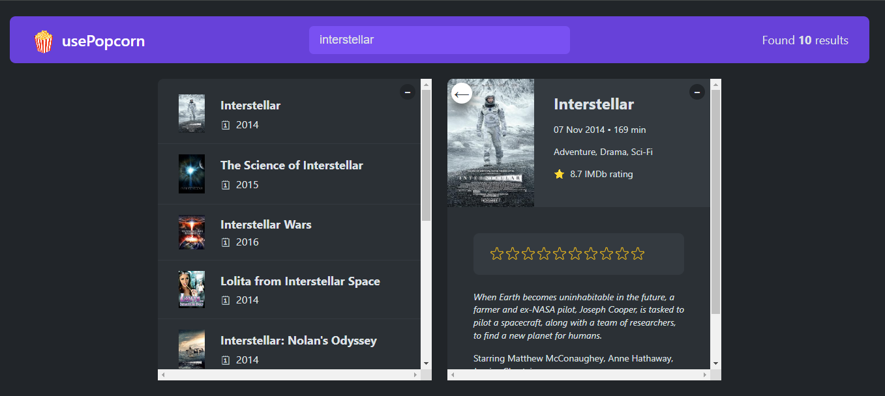

# UsePopcorn

<div id="top"></div>


<!-- PROJECT LOGO -->
<br />
<div align="center">
  <a href="https://use-popcorn-appv1.vercel.app/">
    
  </a>

  <h3 align="center">Use Popcorn</h3>

  <p align="center">
    <a href="https://use-popcorn-appv1.vercel.app/">View Demo</a>
    ·
    <a href="https://github.com/MoazElsayedMohamed/usePopcorn/issues">Report Bug</a>
  </p>
</div>

<!-- TABLE OF CONTENTS -->
<details>
  <summary>Table of Contents</summary>
  <ol>
    <li>
      <a href="#about-the-project">About The Project</a>
      <ul>
        <li><a href="#features">Features</a></li>
        <li><a href="#built-with">Built With</a></li>
        <li><a href="#flowchart">Flowchart</a></li>
        <li><a href="#architecture">Architecture</a></li>
      </ul>
    </li>
    <li>
      <a href="#getting-started">Getting Started</a>
      <ul>
        <li><a href="#installation">Installation</a></li>
        <li><a href="#tree-structure">Tree Structure</a></li>
      </ul>
    </li>
    <li><a href="#contributing">Contributing</a></li>
    <li><a href="#acknowledgments">Acknowledgments</a></li>
  </ol>
</details>

<!-- ABOUT THE PROJECT -->

## About The Project



UsePopcorn is a movie rating web app using the search bar to allow users to search, view, modify, bookmark and add ratings.

### Features

| User Stories                 | Features                                                                                                                                                                        |
| ---------------------------- | ------------------------------------------------------------------------------------------------------------------------------------------------------------------------------- |
| Search for movies            | <ul><li>functionality: input field to send request to API with searched keywords<li>Display results with pagination<li>Display movie with avg.rating and cast of the movie</ul> |
| Rate movies                  | <ul><li>Change rating functionality: give a rting to the movie between 1 and 10</ul>                                                                                            |
| Create list of rating movies | <ul><li>rating a movie will be added to a list of rating movies</ul>                                                                                                            |

<p align="right">(<a href="#top">back to top</a>)</p>

---

### Built With

- [HTML](https://html.com/)
- [CSS](https://www.w3schools.com/css/)
- [JavaScript](https://www.javascript.com/)
- [React](https://www.npmjs.com/package/react)
- Libraries
  - [react-dom](https://www.npmjs.com/package/react-dom)
  - [prop-types](https://www.npmjs.com/package/prop-types)

---

<!-- GETTING STARTED -->

## Getting Started

This project require some prequesites and dependenscies to be installed, you can view it online using this [demo](https://use-popcorn-appv1.vercel.app/). or you can find the instructions below

> To get a local copy, follow these simple steps :

### Installation

1. Clone the repo
   ```sh
   git clone https://github.com/MoazElsayedMohamed/usePopcorn
   ```
2. Go to project folder

```bash
cd usePopcorn
```

3. install dependencies

```bash
npm install
```

4. Run start script

```bash
npm start
```

#### Tree structure

```
usePopcorn
│   .gitignore
│   package-lock.json
│   package.json
│   README.md
│   preview.png
│
└───public
│    index.html
│    robots.txt
│    manifest.json
│
│
│
│
│
└───src
    App.js
    index.css
    index.js
    components
    │       ListBox.js
    │       Loader.js
    │       Logo.js
    │       Main.js
    │       Movie.js
    │       MovieDetails.js
    │       MovieList.js
    │       Navbar.js
    │       NumResults.js
    │       Search.js
    │       StarRating.js
    │       WatchedMovie.js
    │       WatchedMovieList.js
    │       WatchedSummary.js
    │
    hooks
    │       useKey.js
    │       useLocalStorage.js
    │       useMovies


```

<p align="right">(<a href="#top">back to top</a>)</p>

<!-- CONTRIBUTING -->

## Contributing

Contributions are what make the open source community such an amazing place to learn, inspire, and create. Any contributions you make are **greatly appreciated**.

If you have a suggestion that would make this better, please fork the repo and create a pull request. You can also simply open an issue with the tag "enhancement".
Don't forget to give the project a star! Thanks again!

1. Fork the Project
2. Create your Feature Branch (`git checkout -b feature/AmazingFeature`)
3. Commit your Changes (`git commit -m 'Add some AmazingFeature'`)
4. Push to the Branch (`git push origin feature/AmazingFeature`)
5. Open a Pull Request

<p align="right">(<a href="#top">back to top</a>)</p>

<!-- ACKNOWLEDGMENTS -->

## Acknowledgments

- [Jonas schmedtmann](https://github.com/jonasschmedtmann)
